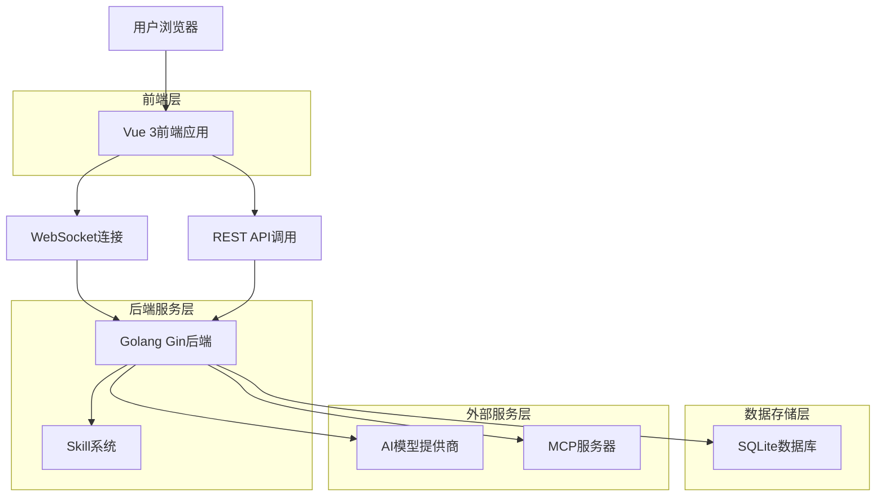
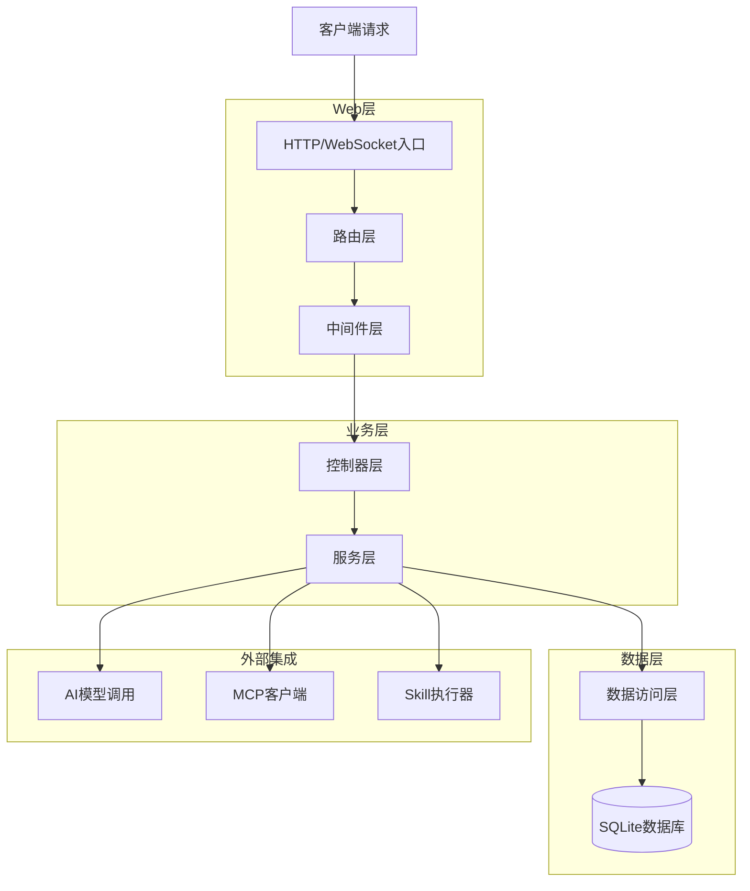
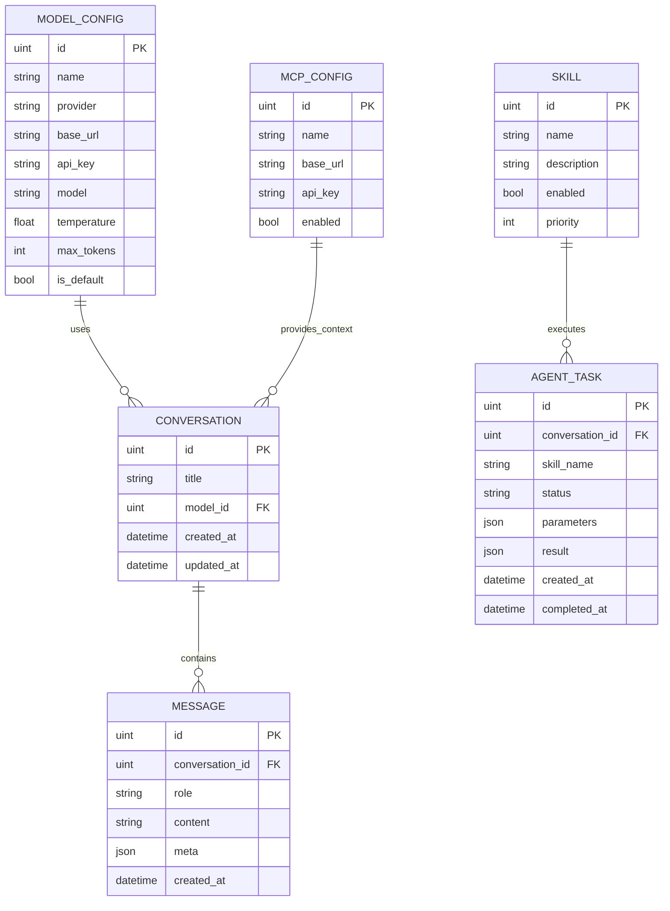

## 1. 架构设计



## 2. 技术描述

* **前端**：Vue 3 + TypeScript + Vite + Pinia

* **初始化工具**：vite-init

* **后端**：Golang 1.21+ + Gin框架 + GORM v2

* **数据库**：SQLite3

* **实时通信**：WebSocket

* **状态管理**：Pinia（前端）、Goroutine（后端会话管理）

## 3. 路由定义

| 路由               | 用途       |
| ---------------- | -------- |
| /                | 聊天主页面    |
| /chat/:id        | 特定会话聊天页面 |
| /settings        | 系统设置页面   |
| /settings/models | 模型配置页面   |
| /settings/mcp    | MCP配置页面  |
| /settings/skills | 技能管理页面   |
| /history         | 会话历史页面   |

## 4. API定义

### 4.1 模型配置API

```
GET /api/models
```

响应：

```json
[
  {
    "id": 1,
    "name": "GPT-4",
    "provider": "openai",
    "base_url": "https://api.openai.com",
    "model": "gpt-4",
    "temperature": 0.7,
    "max_tokens": 2048,
    "is_default": true
  }
]
```

```
POST /api/models
```

请求：

```json
{
  "name": "Claude 3",
  "provider": "anthropic",
  "base_url": "https://api.anthropic.com",
  "api_key": "sk-xxx",
  "model": "claude-3-opus-20240229",
  "temperature": 0.8,
  "max_tokens": 4096,
  "is_default": false
}
```

### 4.2 会话管理API

```
GET /api/conversations
```

```
POST /api/conversations
```

请求：

```json
{
  "title": "新会话",
  "model_id": 1
}
```

```
GET /api/conversations/:id/messages
```

### 4.3 WebSocket协议

连接：

```
ws://localhost:8080/ws/chat/:conversationID
```

消息格式：

```json
// 用户发送
{
  "type": "user_message",
  "content": "用户输入内容",
  "model_id": 1,
  "options": {
    "temperature": 0.7,
    "max_tokens": 2048
  }
}

// AI响应
{
  "type": "thinking",
  "content": "分析用户需求..."
}

{
  "type": "task_update",
  "tasks": [
    {
      "name": "search",
      "status": "running",
      "description": "搜索相关信息"
    }
  ]
}

{
  "type": "message",
  "delta": "回答内容片段"
}

{
  "type": "message_end",
  "message_id": 123
}
```

## 5. 服务器架构



## 6. 数据模型

### 6.1 数据模型定义



### 6.2 数据定义语言

**模型配置表**

```sql
CREATE TABLE model_configs (
    id INTEGER PRIMARY KEY AUTOINCREMENT,
    name VARCHAR(100) NOT NULL,
    provider VARCHAR(50) NOT NULL,
    base_url VARCHAR(500) NOT NULL,
    api_key VARCHAR(500) NOT NULL,
    model VARCHAR(100) NOT NULL,
    temperature REAL DEFAULT 0.7,
    max_tokens INTEGER DEFAULT 2048,
    is_default BOOLEAN DEFAULT FALSE,
    created_at DATETIME DEFAULT CURRENT_TIMESTAMP,
    updated_at DATETIME DEFAULT CURRENT_TIMESTAMP
);

CREATE INDEX idx_model_configs_provider ON model_configs(provider);
CREATE INDEX idx_model_configs_is_default ON model_configs(is_default);
```

**会话表**

```sql
CREATE TABLE conversations (
    id INTEGER PRIMARY KEY AUTOINCREMENT,
    title VARCHAR(200) NOT NULL,
    model_id INTEGER,
    created_at DATETIME DEFAULT CURRENT_TIMESTAMP,
    updated_at DATETIME DEFAULT CURRENT_TIMESTAMP,
    FOREIGN KEY (model_id) REFERENCES model_configs(id)
);

CREATE INDEX idx_conversations_created_at ON conversations(created_at DESC);
```

**消息表**

```sql
CREATE TABLE messages (
    id INTEGER PRIMARY KEY AUTOINCREMENT,
    conversation_id INTEGER NOT NULL,
    role VARCHAR(20) NOT NULL CHECK (role IN ('user', 'assistant', 'system')),
    content TEXT NOT NULL,
    meta JSON,
    created_at DATETIME DEFAULT CURRENT_TIMESTAMP,
    FOREIGN KEY (conversation_id) REFERENCES conversations(id) ON DELETE CASCADE
);

CREATE INDEX idx_messages_conversation_id ON messages(conversation_id);
CREATE INDEX idx_messages_created_at ON messages(created_at);
```

**MCP配置表**

```sql
CREATE TABLE mcp_configs (
    id INTEGER PRIMARY KEY AUTOINCREMENT,
    name VARCHAR(100) NOT NULL,
    base_url VARCHAR(500) NOT NULL,
    api_key VARCHAR(500),
    enabled BOOLEAN DEFAULT TRUE,
    created_at DATETIME DEFAULT CURRENT_TIMESTAMP,
    updated_at DATETIME DEFAULT CURRENT_TIMESTAMP
);
```

**技能表**

```sql
CREATE TABLE skills (
    id INTEGER PRIMARY KEY AUTOINCREMENT,
    name VARCHAR(100) NOT NULL UNIQUE,
    description TEXT,
    enabled BOOLEAN DEFAULT TRUE,
    priority INTEGER DEFAULT 0,
    config JSON,
    created_at DATETIME DEFAULT CURRENT_TIMESTAMP
);

-- 初始化内置技能
INSERT INTO skills (name, description, priority) VALUES
('web_search', '网络搜索技能', 10),
('code_execute', '代码执行技能', 5),
('file_read', '文件读取技能', 8),
('calculator', '计算器技能', 3);
```

**Agent任务表**

```sql
CREATE TABLE agent_tasks (
    id INTEGER PRIMARY KEY AUTOINCREMENT,
    conversation_id INTEGER NOT NULL,
    skill_name VARCHAR(100) NOT NULL,
    status VARCHAR(20) NOT NULL DEFAULT 'pending',
    parameters JSON,
    result JSON,
    error_message TEXT,
    created_at DATETIME DEFAULT CURRENT_TIMESTAMP,
    started_at DATETIME,
    completed_at DATETIME,
    FOREIGN KEY (conversation_id) REFERENCES conversations(id) ON DELETE CASCADE
);

CREATE INDEX idx_agent_tasks_conversation_id ON agent_tasks(conversation_id);
CREATE INDEX idx_agent_tasks_status ON agent_tasks(status);
```

## 7. 业务逻辑实现

### 7.1 Agent核心流程

基于learn-claude-code v0-v9课程的业务逻辑：

1. **v0-v1**: 基础对话管理

   * 多轮上下文维护

   * 消息历史管理

2. **v2-v3**: 任务规划与技能调用

   * 生成todo任务列表

   * 技能选择与调用接口

3. **v4-v5**: 错误处理与并行执行

   * 任务重试机制

   * 多技能并行调用

4. **v6-v7**: 长上下文管理

   * 会话摘要生成

   * 记忆管理

5. **v8-v9**: 高级Agent功能

   * MCP协议集成

   * 复杂任务自动化

### 7.2 Skill选择算法

```go
type SkillSelector struct {
    skills []Skill
    embedder Embedder // 可选：用于语义匹配
}

func (s *SkillSelector) SelectSkills(query string, context map[string]any) []Skill {
    // 1. 过滤启用的技能
    enabledSkills := filterEnabled(s.skills)
    
    // 2. 关键词匹配
    keywordMatches := s.matchKeywords(query, enabledSkills)
    
    // 3. 语义相似度计算（可选）
    semanticMatches := s.calculateSimilarity(query, enabledSkills)
    
    // 4. 综合评分排序
    scoredSkills := s.combineScores(keywordMatches, semanticMatches)
    
    // 5. 返回前N个技能
    return s.topN(scoredSkills, 3)
}
```

## 8. 部署策略

### 8.1 飞牛OS适配

* 静态编译Golang应用，避免依赖问题

* 使用SQLite本地存储，无需额外数据库服务

* 适配ARM64和x86\_64架构

### 8.2 构建脚本

```bash
#!/bin/bash
# build.sh

# 前端构建
cd frontend
npm install
npm run build

# 后端构建
cd ../backend
CGO_ENABLED=1 GOOS=linux GOARCH=amd64 go build -a -installsuffix cgo -ldflags '-extldflags "-static"' -o finuai-agent ./cmd/server

# 打包
cd ..
tar -czf finuai-agent-linux-amd64.tar.gz backend/finuai-agent frontend/dist deploy/
```

### 8.3 系统服务

```ini
# /etc/systemd/system/finuai-agent.service
[Unit]
Description=FinuAI Agent Chat System
After=network.target

[Service]
Type=simple
User=fnos
WorkingDirectory=/opt/finuai-agent
ExecStart=/opt/finuai-agent/finuai-agent
Restart=always
RestartSec=10

[Install]
WantedBy=multi-user.target
```

### 8.4 性能优化

* WebSocket连接池管理

* 模型API调用限流

* 本地缓存机制

* 数据库连接池

* 静态资源压缩

