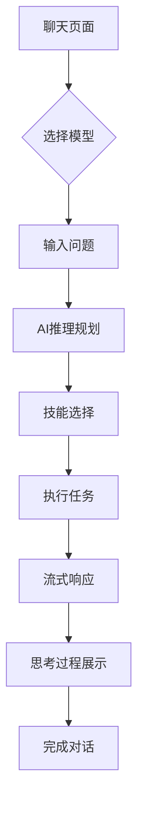
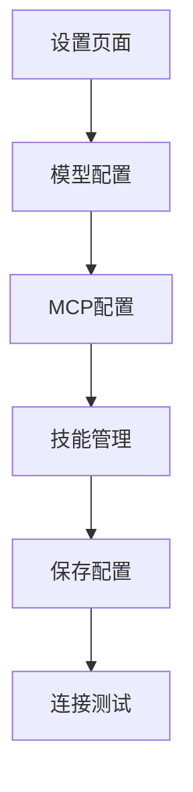

## 1. 产品概述

基于飞牛OS（Debian二次开发的NAS系统）开发的AI Agent实时聊天机器人系统，为用户提供智能化的对话体验和任务执行能力。

目标用户：NAS用户、技术爱好者、需要私有化AI助手的个人和小团队。通过集成多模型支持和技能系统，在本地环境中实现安全可靠的AI交互。

## 2. 核心功能

### 2.1 用户角色

| 角色   | 注册方式    | 核心权限                       |
| ---- | ------- | -------------------------- |
| 管理员  | 系统初始化创建 | 完整系统配置权限，包括模型配置、MCP设置、技能管理 |
| 普通用户 | 本地用户系统  | 使用聊天功能，查看个人会话历史            |

### 2.2 功能模块

系统包含以下核心页面：

1. **聊天页面**：实时对话界面，消息历史展示，AI思考过程可视化
2. **模型配置页面**：模型提供商配置，API设置，参数调整
3. **MCP配置页面**：Model Context Protocol连接管理
4. **技能管理页面**：技能启用/禁用，优先级设置
5. **会话历史页面**：历史对话记录管理

### 2.3 页面详情

| 页面名称    | 模块名称   | 功能描述                              |
| ------- | ------ | --------------------------------- |
| 聊天页面    | 对话区域   | 显示用户与AI的实时对话，支持Markdown渲染和代码高亮    |
| 聊天页面    | 输入区域   | 多行文本输入，支持Enter发送，语音输入选项           |
| 聊天页面    | 思考面板   | 可折叠的AI推理过程展示，包含todo任务列表           |
| 聊天页面    | 模型选择   | 顶部模型切换下拉菜单                        |
| 模型配置页面  | 提供商配置  | 支持OpenAI、Anthropic、Google等主流模型提供商 |
| 模型配置页面  | 自定义API | 支持自定义Base URL配置                   |
| 模型配置页面  | 参数设置   | 温度、最大token数等模型参数调整                |
| MCP配置页面 | 连接管理   | 添加、编辑、删除MCP服务器连接                  |
| MCP配置页面 | 状态监控   | 实时显示MCP连接状态                       |
| 技能管理页面  | 技能列表   | 显示所有可用技能及其描述                      |
| 技能管理页面  | 启用控制   | 技能开关，优先级设置                        |
| 会话历史页面  | 历史列表   | 按时间排序的会话记录                        |
| 会话历史页面  | 搜索功能   | 支持关键词搜索历史对话                       |

## 3. 核心流程

### 用户聊天流程

1. 用户进入聊天页面，选择或创建新会话
2. 输入问题并发送
3. 系统根据问题智能选择合适的技能和模型
4. AI进行推理，生成todo任务列表
5. 执行相关技能，获取信息
6. 流式返回回答内容，同时展示思考过程
7. 用户可展开查看详细的AI推理轨迹

### 配置管理流程

1. 管理员进入设置页面
2. 配置模型提供商和API信息
3. 设置MCP服务器连接
4. 管理技能启用状态
5. 保存配置并测试连接

## 4. 用户界面设计

### 4.1 设计风格

* **主色调**：深色主题，参考Open WebUI设计风格

* **辅助色**：蓝色系用于强调和交互元素

* **按钮样式**：圆角矩形，悬停效果

* **字体**：系统默认无衬线字体，代码使用等宽字体

* **布局**：左侧边栏导航，右侧主内容区域

* **图标**：使用简洁的线性图标

### 4.2 页面设计概述

| 页面名称   | 模块名称 | UI元素                     |
| ------ | ---- | ------------------------ |
| 聊天页面   | 侧边栏  | 深色背景，包含Logo、新建对话、搜索、会话列表 |
| 聊天页面   | 主区域  | 顶部模型选择栏，中间消息列表，底部输入框     |
| 聊天页面   | 消息气泡 | 用户消息右对齐，AI消息左对齐，不同颜色区分   |
| 聊天页面   | 思考面板 | 可折叠卡片，显示推理步骤和任务状态        |
| 模型配置页面 | 配置表单 | 卡片式布局，分组显示不同配置项          |
| 设置页面   | 标签页  | 顶部标签切换不同配置模块             |

### 4.3 响应式设计

* 桌面优先设计，适配大屏幕显示

* 支持平板设备自适应布局

* 移动端提供基础访问支持

### 4.4 交互优化

* 实时流式响应，平滑滚动显示

* 键盘快捷键支持（Ctrl+Enter发送）

* 加载状态指示器

* 错误

